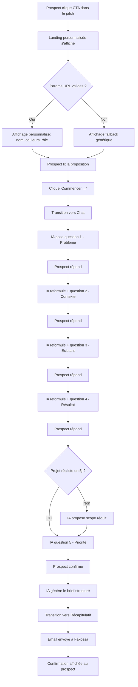
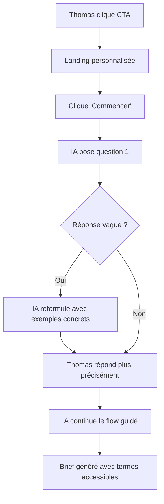
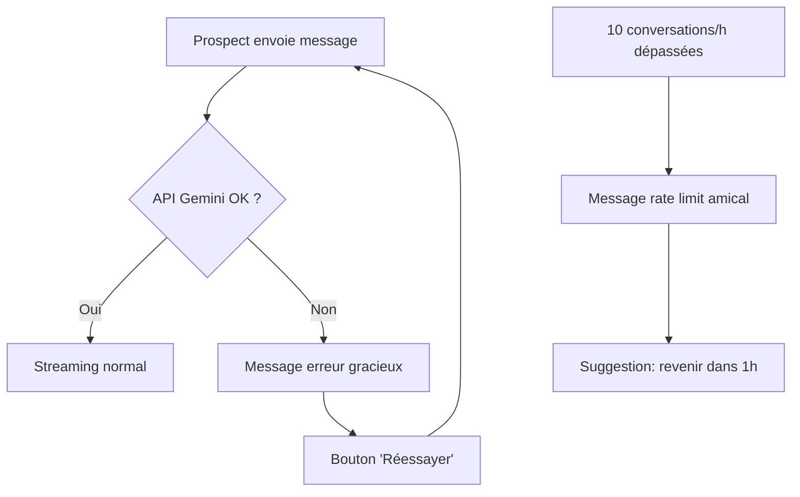

# UX Design Specification defis-5-jours

**Author:** Fakos
**Date:** 2026-03-04

---

## Executive Summary

### Project Vision

Le Défi 5 Jours est une app web single-page qui convertit les prospects issus des pitchs HTML de Fakossa en briefs structurés. L'expérience est personnalisée aux couleurs de chaque entreprise prospect via des query params URL. L'app guide le prospect à travers un chat IA conversationnel en 3-5 minutes pour produire un brief de projet cadré et réaliste.

### Target Users

**Primaire — Sophie (Décideuse PME)** : CEO/manager non-technique, arrive depuis le pitch, curieuse mais sceptique. Décrit son besoin en termes business. Apprécie la personnalisation et la rapidité.

**Secondaire — Thomas (RH/Recruteur)** : Moins technique, besoin de plus de guidage. Transmet le brief en interne. L'IA doit adapter son niveau de questions.

**Opérateur — Fakossa** : Reçoit le brief par email, décide go/no-go. Ne passe pas par l'app, mais bénéficie de la qualité du brief structuré.

### Key Design Challenges

1. **Personnalisation dynamique** : chaque prospect voit les couleurs et le nom de sa société — l'accent color doit fonctionner avec le design system fixe (cream/charcoal)
2. **Confiance immédiate** : le prospect doit comprendre le concept en < 3 sec et se sentir "chez lui"
3. **Chat IA non-intimidant** : éviter le syndrome "chatbot corporate" — garder un ton chaleureux et des échanges courts
4. **Progression visible** : le prospect ne doit jamais se demander "c'est encore long ?"

### Design Opportunities

1. **Effet "wow" de la personnalisation** : le prospect voit le nom de sa boîte et ses couleurs dès la landing — crée un sentiment de service sur-mesure
2. **Chat conversationnel > formulaire** : une conversation naturelle de 3-5 min est plus engageante qu'un formulaire de 15 champs
3. **Récapitulatif professionnel** : le brief généré donne une image de sérieux et de compétence avant même le premier contact

---

## Core User Experience

### Defining Experience

**"Décrivez votre projet en 5 minutes, recevez un scope clair."**

L'interaction qui définit le produit : le prospect décrit son problème à un assistant IA chaleureux, et reçoit instantanément un brief structuré avec un scope réaliste pour 5 jours. C'est le moment où le prospect passe de "je suis curieux" à "il a compris exactement ce dont j'ai besoin".

Comparable à : la simplicité de Typeform (une question à la fois) combinée à l'intelligence de ChatGPT (reformulation, cadrage).

### Platform Strategy

- **Web-only** (SPA Next.js) — pas de mobile app, pas de desktop
- **Mobile-first responsive** — la majorité des prospects ouvriront le pitch sur mobile (email → clic)
- **Touch-first sur mobile** — le chat doit être utilisable au pouce
- **Pas d'offline** — connexion requise pour le chat IA
- **Pas d'installation** — accès direct via URL

### Effortless Interactions

| Interaction | Doit être effortless |
|---|---|
| Arrivée depuis le pitch | Zéro action requise — la personnalisation est automatique via les params URL |
| Début du chat | Un seul clic sur "Commencer" |
| Réponse au chat | Taper + Enter, comme un SMS |
| Progression | Visible en permanence sans action — barre automatique |
| Fin du chat | L'IA annonce la fin, le récap apparaît automatiquement |
| Confirmation | Aucune action requise — "Fakossa a reçu votre brief" s'affiche |

### Critical Success Moments

1. **Landing** (< 3 sec) : le prospect voit le nom de sa boîte + comprend le concept → "c'est pour moi"
2. **Première réponse IA** (< 500ms premier token) : l'IA répond vite et bien → "c'est intelligent"
3. **Reformulation** : l'IA reformule la réponse du prospect → "il a compris"
4. **Récapitulatif** : le brief structuré apparaît → "c'est exactement ça"

### Experience Principles

1. **Personnalisation silencieuse** — tout est personnalisé automatiquement, le prospect ne saisit rien
2. **Conversation, pas formulaire** — une question à la fois, ton chaleureux, échanges courts
3. **Progression tangible** — barre visuelle, étapes numérotées, jamais de sentiment d'infini
4. **Professionnalisme sans froideur** — design soigné mais ton humain

---

## Emotional Response Goals

### Desired Emotions by State

| État | Émotion visée | Comment |
|---|---|---|
| Landing | Curiosité + Confiance | Personnalisation (nom, couleurs), proposition claire, design pro |
| Début chat | Facilité + Engagement | Première question simple, ton chaleureux, streaming visible |
| Pendant chat | Compréhension + Progression | Reformulations, barre de progression, messages courts |
| Récapitulatif | Satisfaction + Réassurance | Brief clair, scope réaliste, "Fakossa revient sous 24h" |
| Post-brief | Anticipation | Le prospect attend la réponse de Fakossa avec confiance |

### Emotional Anti-Patterns

- **Jamais** de loader circulaire sans contexte — toujours streaming mot par mot
- **Jamais** de jargon technique non expliqué
- **Jamais** de sentiment "j'ai répondu à tout ça pour rien"
- **Jamais** de mur de texte dans le chat — messages IA de 2-3 phrases max

---

## Design System Foundation

### Design System Choice

**Tailwind CSS + Custom Design Tokens** — système themeable avec CSS custom properties.

**Rationale** :
- Fakossa développe en solo — Tailwind accélère le développement sans dépendance UI lourde
- La personnalisation dynamique (couleur d'accent par prospect) nécessite des CSS custom properties, pas un design system rigide
- Cohérence garantie avec les pitchs HTML qui utilisent déjà la même palette

### Color System

#### Tokens statiques (invariables)

| Token | Valeur | Usage |
|---|---|---|
| `--cream-50` | `#FFFDF9` | Background principal |
| `--cream-100` | `#FFF8EF` | Background secondaire, cartes |
| `--charcoal-900` | `#2A2724` | Texte principal |
| `--charcoal-700` | `#4A453F` | Texte titre secondaire |
| `--charcoal-500` | `#7D756B` | Texte secondaire, placeholders |
| `--charcoal-200` | `#D4CFC8` | Bordures, séparateurs |
| `--emerald-500` | `#10B981` | Succès, validations, progression |
| `--emerald-50` | `#ECFDF5` | Background succès |
| `--red-500` | `#EF4444` | Erreurs |
| `--red-50` | `#FEF2F2` | Background erreur |

#### Token dynamique (personnalisé par prospect)

| Token | Valeur par défaut | Source |
|---|---|---|
| `--accent` | `#F96743` (coral) | Query param `color` ou fallback |
| `--accent-light` | Calculé : accent + opacity 10% | Backgrounds hover, highlights |
| `--accent-dark` | Calculé : accent - 15% luminosité | Hover boutons |

**Implémentation** : la valeur de `--accent` est injectée dans le `<style>` du `<html>` au chargement de la page, basée sur le query param `color`. Si pas de param ou valeur invalide (pas un hex), fallback sur `#F96743`.

**Validation de contraste** : si la couleur fournie n'atteint pas le ratio WCAG AA (4.5:1) sur fond cream, appliquer un assombrissement automatique.

### Typography System

| Token | Valeur | Usage |
|---|---|---|
| Font family | `Inter` (Google Fonts) | Tout le texte |
| `--text-display` | 36px / 700 / -0.02em | Titre principal "LE DÉFI 5 JOURS" |
| `--text-h1` | 28px / 700 / -0.01em | Sous-titre "× [Entreprise]" |
| `--text-h2` | 22px / 600 | Titres de section |
| `--text-h3` | 18px / 600 | Sous-titres |
| `--text-body` | 16px / 400 / 1.6 line-height | Texte courant, messages chat |
| `--text-small` | 14px / 400 | Labels, texte secondaire |
| `--text-caption` | 12px / 500 | Barre de progression, métadonnées |

### Spacing & Layout Foundation

| Token | Valeur | Usage |
|---|---|---|
| `--space-unit` | 4px | Unité de base |
| `--space-xs` | 4px | Padding compact |
| `--space-sm` | 8px | Gaps internes |
| `--space-md` | 16px | Padding standard |
| `--space-lg` | 24px | Gaps entre sections |
| `--space-xl` | 32px | Margins principales |
| `--space-2xl` | 48px | Espacement sections majeures |
| `--radius-sm` | 8px | Badges, chips |
| `--radius-md` | 14px | Boutons, inputs, cartes |
| `--radius-lg` | 20px | Modales, containers |
| `--radius-full` | 9999px | Avatars |
| `--shadow-sm` | `0 1px 3px rgba(42,39,36,.06)` | Cartes, boutons au repos |
| `--shadow-md` | `0 4px 12px rgba(42,39,36,.08)` | Cartes élevées, popovers |
| `--shadow-lg` | `0 8px 24px rgba(42,39,36,.12)` | Modales |

**Layout** : colonne centrée max 640px pour le chat (largeur optimale de lecture). Landing en pleine largeur max 800px. Padding horizontal 16px mobile, 24px tablet, 32px desktop.

### Accessibility Considerations

- Contraste texte principal sur cream : #2A2724 sur #FFFDF9 = ratio ~15:1 (AAA)
- Contraste accent dynamique : validation automatique, assombrissement si < 4.5:1
- Focus visible : outline 2px accent + offset 2px
- Navigation clavier : Tab pour naviguer, Enter pour envoyer, Escape pour fermer
- Labels ARIA sur tous les éléments interactifs
- `aria-live="polite"` sur la zone de streaming IA pour les lecteurs d'écran

---

## Core User Experience Detail

### User Mental Model

Le prospect pense : "Je décris mon besoin à quelqu'un d'intelligent, il me dit ce qu'il peut faire en 5 jours." C'est le modèle mental d'une conversation avec un consultant, pas d'un formulaire à remplir ni d'un chatbot de support.

**Implications UX** :
- L'IA parle comme un humain, pas comme un robot
- Les bulles de chat ressemblent à iMessage (familier pour tous)
- Pas de "Sélectionnez une option" — que du texte libre
- L'IA reformule (comme un humain qui écoute) plutôt que de passer à la question suivante

### Experience Mechanics

#### Initiation (Landing → Chat)

```
[Prospect arrive] → [Landing personnalisée s'affiche]
                       ↓
              [Lit le titre + proposition]
                       ↓
              [Voit "Comment ça marche" (3 étapes)]
                       ↓
              [Clique "Commencer →"]
                       ↓
              [Transition smooth vers l'état Chat]
              [Premier message IA s'affiche en streaming]
```

#### Interaction (Chat)

```
[IA pose une question courte] → [Prospect tape sa réponse]
                                        ↓
                                [Enter pour envoyer]
                                        ↓
                          [Bulle prospect apparaît à droite]
                          [Indicateur "typing" côté IA]
                                        ↓
                          [IA répond en streaming]
                          [Reformule + nouvelle question]
                                        ↓
                          [Barre progression avance]
                          [Label étape se met à jour]
```

#### Completion (Brief)

```
[IA dit "Parfait, j'ai tout ce qu'il faut"]
                    ↓
        [Transition vers état Récapitulatif]
        [Brief s'affiche avec animation fade-in]
                    ↓
        [Email envoyé à Fakossa en background]
                    ↓
        [Message confirmation : "Fakossa revient sous 24h"]
        [CTA Calendly visible]
```

---

## Visual Design Foundation

### Design Direction

**Mot-clé** : "Craft studio chaleureux" — professionnel mais humain, épuré mais pas froid.

**Références visuelles** :
- Warmth de Linear (fond clair, typo soignée)
- Simplicité de Notion (espaces blancs, hiérarchie claire)
- Personnalisation de Loom (branding dynamique dans l'interface)

### Layout par État

#### État 1 — Landing

```
┌──────────────────────────────────────────────────────┐
│ ○ Avatar Fakossa (32px, coin haut gauche)             │
│                                                       │
│         LE DÉFI 5 JOURS                               │
│         × [Nom Entreprise]     ← --accent color       │
│                                                       │
│         "Décrivez votre projet.                       │
│          Dans 5 jours, il existe."                    │
│                                                       │
│         ┌────────────────────────────────────┐        │
│         │ Vous cherchiez un(e) [rôle].       │        │
│         │ Et si on testait autre chose ?     │        │
│         └────────────────────────────────────┘        │
│                  ↑ affiché si param role présent       │
│                                                       │
│         ┌────────────────────────────────────┐        │
│         │  Comment ça marche ?                │        │
│         │                                    │        │
│         │  1. Décrivez votre projet           │        │
│         │  2. Je scope en 5 jours             │        │
│         │  3. Je vous livre le résultat       │        │
│         └────────────────────────────────────┘        │
│                                                       │
│         ┌────────────────────────────────────┐        │
│         │         Commencer →                 │        │
│         └────────────────────────────────────┘        │
│              ↑ bouton accent, radius-md                │
│                                                       │
│         Zéro engagement. Gratuit.                     │
│              ↑ text-small, charcoal-500               │
└──────────────────────────────────────────────────────┘
```

**Fallback sans params** : "LE DÉFI 5 JOURS" sans "× [Entreprise]", pas de section rôle, couleur accent coral par défaut.

#### État 2 — Chat

```
┌──────────────────────────────────────────────────────┐
│  Le Défi 5 Jours × [Entreprise]                      │
│  ─────────────────────────────────────────────────── │
│                                                       │
│  ┌─ IA ───────────────────────────────────────┐      │
│  │ ○ Bonjour ! Je suis l'assistant de         │      │
│  │   Fakossa. Je vais vous aider à décrire    │      │
│  │   votre projet...                          │      │
│  └────────────────────────────────────────────┘      │
│                                                       │
│                  ┌─ Prospect ──────────────┐         │
│                  │ On a besoin d'un outil   │         │
│                  │ pour suivre nos...       │         │
│                  └─────────────────────────┘         │
│                                                       │
│  ┌─ IA ───────────────────────────────────────┐      │
│  │ ○ Si je comprends bien, vous avez besoin   │      │
│  │   d'un outil de suivi pour [X]. Qui va     │      │
│  │   l'utiliser au quotidien ?                │      │
│  └────────────────────────────────────────────┘      │
│                                                       │
│  ┌──────────────────────────────────────┐  [↑]      │
│  │ Tapez votre message...               │            │
│  └──────────────────────────────────────┘            │
│                                                       │
│  Étape 2/5 — Contexte utilisateurs                   │
│  ████████████░░░░░░░░░░░░░░░░░░ 40%                  │
│  ↑ barre accent color, label text-caption             │
└──────────────────────────────────────────────────────┘
```

**Bulles de chat** :
- IA : fond `cream-100`, bord-gauche accent (2px), aligné à gauche, avatar Fakossa (24px)
- Prospect : fond `accent-light`, texte `charcoal-900`, aligné à droite
- Max-width bulles : 85% de la zone chat

**Streaming** : le texte IA apparaît mot par mot avec un curseur clignotant (|). Pas de "●●●" loading — le streaming commence directement.

#### État 3 — Récapitulatif

```
┌──────────────────────────────────────────────────────┐
│                                                       │
│     ✓ Brief prêt !            ← emerald-500           │
│                                                       │
│  ┌────────────────────────────────────────────┐      │
│  │  BRIEF PROJET — [Entreprise]               │      │
│  │  ────────────────────────────────          │      │
│  │                                            │      │
│  │  Problème                                  │      │
│  │  [texte]                                   │      │
│  │                                            │      │
│  │  Utilisateurs cibles                       │      │
│  │  [texte]                                   │      │
│  │                                            │      │
│  │  Solution actuelle                         │      │
│  │  [texte]                                   │      │
│  │                                            │      │
│  │  Résultat attendu                          │      │
│  │  [texte]                                   │      │
│  │                                            │      │
│  │  Périmètre 5 jours                         │      │
│  │  [texte]                                   │      │
│  │                                            │      │
│  │  Livrable suggéré                          │      │
│  │  [texte]                                   │      │
│  └────────────────────────────────────────────┘      │
│     ↑ carte cream-100, shadow-md, radius-lg           │
│                                                       │
│  "Fakossa a reçu votre brief.                        │
│   Il revient vers [contact/vous] sous 24h             │
│   avec une proposition."                              │
│                                                       │
│  ┌────────────────────────────────────┐              │
│  │     Prendre RDV directement →      │              │
│  └────────────────────────────────────┘              │
│     ↑ bouton accent, lien vers Calendly               │
│                                                       │
└──────────────────────────────────────────────────────┘
```

---

## User Journey Flows

### Journey 1 : Prospect → Brief (Happy Path)



### Journey 2 : Prospect non-technique (Thomas)



### Journey 3 : Erreur / Edge cases



### Flow Optimization Principles

1. **Zéro étape inutile** : pas d'écran de bienvenue supplémentaire, pas de "Accepter les CGU", pas de captcha
2. **Streaming immédiat** : le premier token apparaît en < 500ms — jamais de temps mort
3. **Progression toujours visible** : la barre avance à chaque étape, le label change
4. **Erreurs non-bloquantes** : en cas d'erreur API, proposer de réessayer sans perdre la conversation

---

## Component Strategy

### Tailwind Primitives (design system natif)

Utilisés directement sans custom component :
- Typographie (font-inter, text-[size])
- Spacing (p-[n], m-[n], gap-[n])
- Couleurs (via CSS custom properties)
- Border radius, shadows
- Flexbox/Grid layout

### Custom Components

#### `<Landing />`

- **Purpose** : écran d'accueil personnalisé
- **Props** : company, role, sector, color, contact
- **States** : avec params / sans params (fallback)
- **Contient** : header avatar, titre, proposition, étapes, CTA

#### `<Chat />`

- **Purpose** : interface de chat IA conversationnel
- **Props** : company, role, sector (contexte pour le system prompt)
- **States** : en cours, streaming, erreur, terminé
- **Contient** : liste de messages, input, barre de progression

#### `<ChatMessage />`

- **Purpose** : bulle de message individuelle
- **Props** : role (assistant/user), content, isStreaming
- **States** : complet, en streaming (curseur clignotant)
- **Variantes** : bulle IA (gauche, cream-100, avatar) / bulle prospect (droite, accent-light)

#### `<ProgressBar />`

- **Purpose** : indicateur de progression des étapes
- **Props** : currentStep (1-5), totalSteps (5)
- **States** : active, complète
- **Affiche** : barre remplie (accent color) + label "Étape X/5 — [Nom étape]"

#### `<BriefSummary />`

- **Purpose** : récapitulatif du brief généré
- **Props** : briefData (objet structuré), company, contact
- **States** : loading (brief en cours de génération), ready
- **Contient** : carte avec sections, message confirmation, CTA Calendly

#### `<Header />`

- **Purpose** : header compact avec branding
- **Props** : company, state (landing/chat/recap)
- **States** : landing (juste avatar), chat (titre + entreprise), recap (masqué)

### Component Implementation Strategy

- Phase 1 (MVP) : Landing, Chat, ChatMessage, ProgressBar, BriefSummary, Header
- Pas de Phase 2 prévue — l'app est simple, 6 composants suffisent
- Tous les composants utilisent les CSS custom properties pour le theming dynamique

---

## UX Consistency Patterns

### Button Hierarchy

| Niveau | Style | Usage |
|---|---|---|
| Primary | Fond accent, texte blanc, shadow-sm, radius-md | CTA "Commencer", "Prendre RDV" |
| Secondary | Fond transparent, bordure accent, texte accent | Actions secondaires |
| Ghost | Fond transparent, texte charcoal-500 | Liens contextuels |

**Hover** : primary → accent-dark. Secondary → accent-light fond. Ghost → underline.

**Active** : scale(0.98) + shadow interne léger.

### Feedback Patterns

| Type | Visuel | Usage |
|---|---|---|
| Streaming IA | Texte mot par mot + curseur `|` clignotant | Réponse IA en cours |
| Succès (brief envoyé) | Icône ✓ emerald + texte "Brief prêt !" | Fin du flow |
| Erreur API | Bandeau rouge-50 + texte "Oups, un souci..." + bouton Réessayer | Erreur Gemini/réseau |
| Rate limit | Message inline charcoal-500 "Beaucoup de demandes, revenez dans quelques minutes" | Limite atteinte |

### Form Patterns

- **Input chat** : fond blanc, bordure charcoal-200, radius-md, placeholder "Tapez votre message..."
- **Submit** : Enter pour envoyer (desktop), bouton flèche ↑ (mobile) en accent color
- **Pas de validation** : le chat est en texte libre, l'IA gère les réponses vagues

### Navigation Patterns

- **Pas de navigation classique** : app single-page, 3 états séquentiels
- **Retour** : non disponible (le flow est linéaire et court)
- **Transitions entre états** : fade-in/fade-out smooth (300ms ease)

### Loading & Empty States

| État | Visuel |
|---|---|
| Chargement initial | Skeleton landing (titre + CTA) pendant le parsing des params |
| Attente réponse IA | Pas de loader — le streaming commence directement |
| Erreur chargement | "Impossible de charger l'assistant. Vérifiez votre connexion." + bouton Réessayer |

---

## Responsive Design

### Breakpoints

| Breakpoint | Largeur | Adaptations |
|---|---|---|
| Mobile | < 640px | Padding 16px, font-display 28px, bulles 90% width, input sticky bottom |
| Tablet | 640-1024px | Padding 24px, layout centré max 640px |
| Desktop | > 1024px | Padding 32px, layout centré max 640px (chat) / 800px (landing) |

### Mobile Specifics

- **Input chat sticky** : le champ de saisie reste fixé en bas de l'écran (position: sticky)
- **Clavier virtuel** : quand le clavier s'ouvre, la zone de chat scroll automatiquement vers le dernier message
- **Bulles** : max-width 90% sur mobile (vs 85% desktop)
- **Barre de progression** : toujours visible au-dessus de l'input, même avec le clavier ouvert
- **CTA landing** : pleine largeur sur mobile

### Touch Targets

- Taille minimum : 44px × 44px pour tous les éléments interactifs
- Bouton "Commencer" : hauteur 48px minimum
- Bouton envoi chat : 44px × 44px
- Espacement entre éléments cliquables : minimum 8px

---

## Interaction & Animation

### Transitions

| Transition | Durée | Easing | Description |
|---|---|---|---|
| Landing → Chat | 400ms | ease-out | Fade-out landing, fade-in chat |
| Chat → Récap | 400ms | ease-out | Fade-out chat, fade-in récap avec scale subtle |
| Nouvelle bulle | 200ms | ease-out | Slide-up + fade-in depuis le bas |
| Barre progression | 300ms | ease-in-out | Width transition smooth |

### Micro-interactions

- **Bouton CTA hover** : translateY(-1px) + shadow-md
- **Bouton CTA active** : translateY(0) + scale(0.98)
- **Curseur streaming** : opacity blink 0→1→0 (800ms loop)
- **Avatar IA** : léger bounce à chaque nouveau message (translateY -2px, 150ms)

### Animations à éviter

- Pas de parallax
- Pas d'animations au scroll
- Pas de transitions longues (> 500ms)
- Pas d'animations qui bloquent l'interaction
